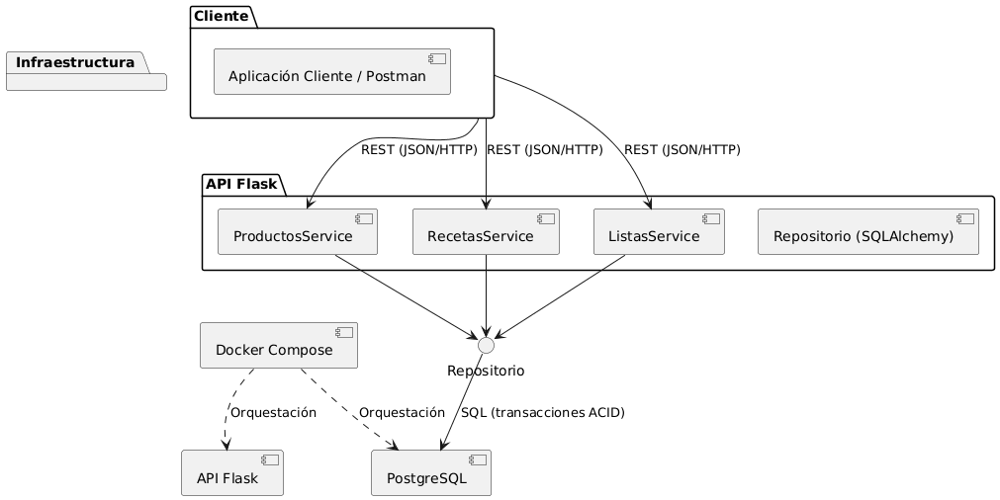

# UT3 - TFU - Resolución Parte 1

## Modelo de componentes

En la siguiente figura se representa el modelo de componentes del sistema en notación UML, incluyendo los componentes principales, las interfaces expuestas y consumidas, así como las dependencias establecidas entre ellos.

### Descripción de las interfaces

En relación con las interfaces del sistema, puede observarse que la API Flask constituye el punto de entrada principal para los clientes externos. A través de esta capa se exponen distintas interfaces de tipo REST, estructuradas en torno a los recursos fundamentales del dominio: `/productos`, `/recetas` y `/listas`. Cada una de estas rutas permite realizar operaciones mediante solicitudes HTTP en formato JSON, lo cual facilita la interoperabilidad con aplicaciones cliente de distinto tipo, ya sea un cliente ligero de pruebas como Postman o un futuro frontend web o móvil.

Ahora bien, los servicios de dominio que conforman la API no interactúan directamente con la base de datos, sino que lo hacen mediante la interfaz proporcionada por el repositorio implementado con SQLAlchemy. Esta capa de persistencia ofrece operaciones de tipo CRUD y, además, brinda soporte a transacciones que garantizan propiedades ACID, como ocurre en la creación de una receta con múltiples productos asociados. De este modo, se asegura una clara separación entre la lógica de negocio y el acceso a los datos.

A su vez, el DBMS PostgreSQL expone su propia interfaz a través del protocolo SQL estándar, disponible en el puerto 5432. Es precisamente esta interfaz la que consume el repositorio para ejecutar las instrucciones de inserción, consulta o eliminación, bajo las garantías propias de un gestor de base de datos transaccional.

Finalmente, la capa de infraestructura, gestionada mediante Docker Compose, incorpora su propia interfaz de orquestación. A través de ella es posible desplegar los contenedores que alojan tanto la API como la base de datos, definir sus dependencias y establecer la red que posibilita la comunicación entre servicios. Gracias a esta interfaz declarativa, la solución puede iniciarse, detenerse o escalarse con comandos simples, garantizando así portabilidad y facilidad de despliegue en distintos entornos.

## Partición

Se optó por una partición por dominio como criterio de primer nivel, lo cual es coherente con los principios de *Domain Driven Design* (Evans, 2004) y con las ventajas mencionadas en la unidad.

- Los componentes de alto nivel (Productos, Recetas, Listas) reflejan directamente conceptos del dominio, facilitando la comprensión del sistema.
- El modelado por dominio se alinea con arquitecturas modulares y con estilos orientados a microservicios, lo que habilita la evolución futura de la solución.
- Se favorece la cohesión dentro de cada componente y se minimiza el acoplamiento global, ya que la interacción se produce únicamente a través de interfaces bien definidas.

En contraste, una partición técnica hubiera organizado los componentes en torno a capas genéricas (presentación, lógica, persistencia), pero con mayor acoplamiento a nivel de datos y menor cercanía con el negocio, lo cual no resulta óptimo para este caso.

## Proceso de hallazgo de los componentes

El proceso de identificación de componentes siguió el ciclo recomendado en el material del curso.

En primer lugar, el proceso de hallazgo de los componentes comenzó con una etapa de identificación inicial, en la que se partió de los elementos más representativos del dominio del problema. A partir de los requerimientos planteados por la aplicación —un recetario digital que permite gestionar productos, crear recetas y armar listas de compras— se identificaron como candidatos naturales los componentes Productos, Recetas y Listas. Estos conceptos constituyen la base del negocio y, por lo tanto, resultaron adecuados para ser tratados como unidades de software independientes.

Posteriormente, se procedió a un análisis de roles y responsabilidades. En esta instancia, cada componente fue delimitado en función de las operaciones que debía soportar. Por ejemplo, el componente *Recetas* no se limita a almacenar información estática, sino que tiene la responsabilidad de permitir la creación de nuevas recetas, asociar los productos que las integran y garantizar que estas operaciones se realicen de manera transaccional. De forma análoga, el componente *Productos* se ocupa de administrar el catálogo de insumos disponibles, posibilitando tanto su alta y baja como su consulta. En el caso de *Listas*, la responsabilidad recae en permitir la agrupación de productos en listas de compras semanales o temáticas, lo cual constituye una funcionalidad diferenciada dentro del dominio.

Una vez definidos los roles básicos, se llevó a cabo un análisis de atributos de calidad. Este análisis buscó determinar en qué medida los componentes respondían a los requerimientos no funcionales planteados en la unidad. Se priorizó, en primer lugar, la consistencia de los datos, garantizada a través del uso de transacciones ACID en la base de datos PostgreSQL. Asimismo, se buscó favorecer la mantenibilidad, asegurando que cada componente tuviera responsabilidades claras y no superpuestas. Finalmente, se tuvo en cuenta la escalabilidad, especialmente en lo que refiere a la API expuesta por Flask, que al ser *stateless* puede replicarse fácilmente en múltiples instancias de contenedor sin que se vea comprometido el estado de la aplicación.

Finalmente, se realizó un proceso de reestructuración destinado a evitar el anti-patrón conocido como *entity trap*. En lugar de diseñar los componentes exclusivamente en función de las tablas de la base de datos, se priorizó la identificación de servicios con responsabilidades de negocio claramente definidas. Así, por ejemplo, no se creó un componente aislado para la tabla intermedia `receta_producto`, sino que se entendió que dicha funcionalidad forma parte del comportamiento del componente Recetas. Esta decisión permitió mantener la cohesión y garantizar que el modelo de componentes refleje fielmente las operaciones del negocio, en lugar de replicar de manera mecánica la estructura de persistencia.

Como técnicas auxiliares se aplicó la combinación de actor/acción  -identificando operaciones de los usuarios-  y workflow -modelando el flujo de creación de recetas-, en coherencia con los métodos propuestos en la bibliografía de la unidad.

## Impacto del uso de VM en la solución

En la implementación se eligió el uso de contenedores Docker para desplegar tanto la API como la base de datos.

### Justificación de la elección

- Mayor ligereza y rapidez de arranque, al compartir el kernel con el sistema operativo anfitrión.
- Mejor portabilidad, dado que las imágenes pueden replicarse en distintos entornos sin modificaciones.
- Facilidad para el escalado horizontal, permitiendo ejecutar múltiples instancias de la API con un simple comando (`--scale`).
- Adecuados para escenarios de desarrollo académico y proyectos modulares

### Impacto de utilizar VMs

- Mayor consumo de recursos a raíz de que cada VM requiere un sistema operativo completo.
- Tiempos de inicio más largos y mayor complejidad en la configuración.
- Dificultades adicionales en la portabilidad y gestión de imágenes, lo cual ralentizaría los ciclos de prueba y despliegue.
- Como ventaja, las VMs ofrecerían mayor aislamiento y seguridad, lo que podría ser beneficioso en entornos críticos, aunque con un costo operativo considerable. En nuestro caso …

## Impacto del uso de BASE en la solución

La solución implementada se basa en el modelo ACID, dado que la aplicación de recetas requiere garantizar la consistencia y validez de los datos en todo momento.

### Justificación de la elección

- Atomicidad: la creación de una receta implica registrar tanto la receta como sus productos asociados, operación que debe realizarse de forma indivisible.
- Consistencia: se asegura que la base de datos siempre se mantenga en un estado válido, respetando las restricciones de integridad.
- Aislamiento: múltiples usuarios pueden operar simultáneamente sin interferir entre sí.
- Durabilidad: los cambios confirmados persisten aun ante fallos del sistema.

### Impacto de utilizar BASE

- Se obtendría alta disponibilidad y tolerancia a particiones, pero sacrificando consistencia fuerte.
- Podrían generarse ventanas de inconsistencia, donde una receta aparezca creada sin todos sus productos.
- Sería necesario diseñar mecanismos adicionales - por ejemplo, compensaciones o reconciliaciones - para mantener la lógica de negocio.
- La complejidad del sistema aumentaría innecesariamente para un proyecto de las características del recetario académico.
